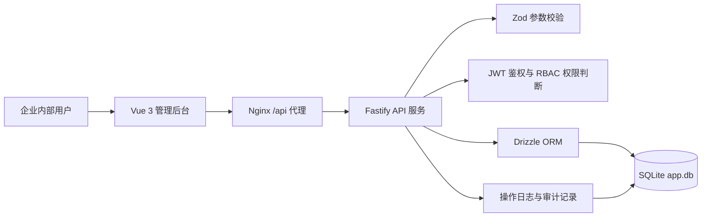
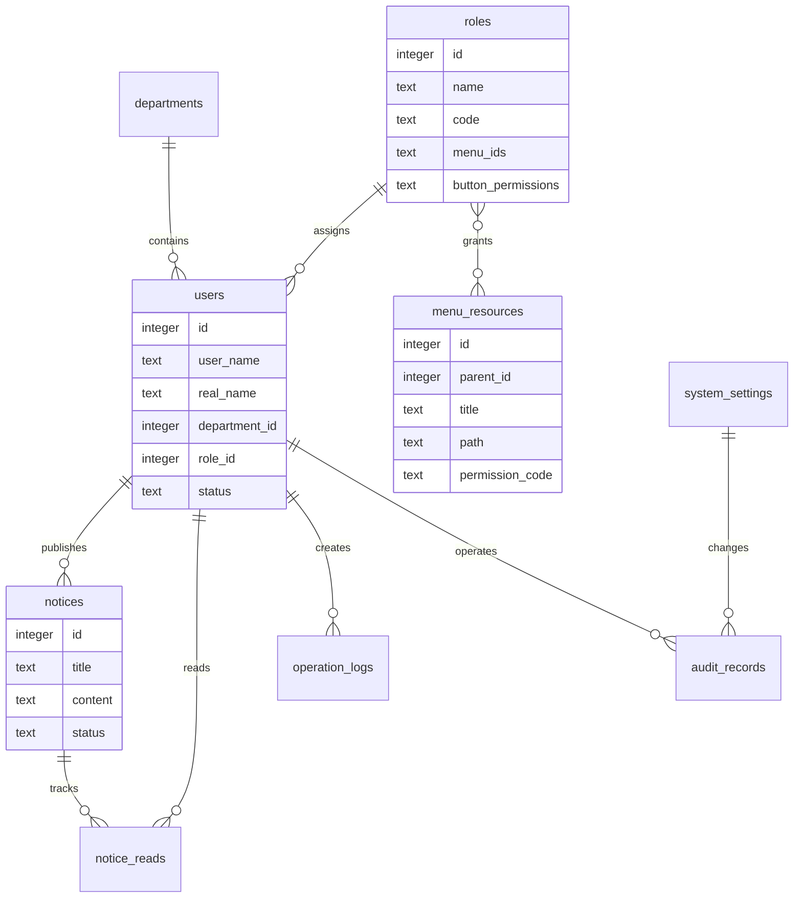

# 企业运营工作台与权限中心

一句话定位：为中小企业提供组织账号、RBAC 权限、公告协同与审计留痕的一体化后台系统。

## 🛠 技术栈
- Frontend: Vue 3 + Vite + Element Plus + Pinia + Vue Router
- Backend: Node.js + Fastify + Zod + JWT
- Database: SQLite + Drizzle ORM
- Infra: Docker Compose + Nginx

## 🚀 启动指南 (How to Run)
1. 确保 Docker Desktop 已启动。
2. 在交付环境目录执行：`docker build -t save-repo-fullstack1 .`
3. 启动容器：`docker run --rm -p 3000:3000 -p 8000:8000 save-repo-fullstack1`
4. 打开前端地址并使用测试账号登录。

## 🔗 服务地址 (Services)
- Frontend: http://localhost:3000
- Backend Swagger: http://localhost:8000/docs
- Backend Health: http://localhost:8000/api/health
- Database: SQLite 文件位于后端 `/app/backend/data/app.db`

## 🧪 测试账号
- 系统管理员：admin / 123456
- 运营主管：ops01 / 123456
- 业务人员：biz01 / 123456
- 审计员：audit01 / 123456

## 🏗️ 系统架构


核心模块职责：
- 账号与组织：维护用户、部门、角色归属和账号状态。
- 权限中心：配置角色菜单和按钮权限，登录后按权限展示侧边栏与页面。
- 公告协同：运营主管发布公告，业务人员确认阅读，系统记录阅读与处理状态。
- 审计留痕：记录登录、公告处理、权限变更和参数修改。
- 数据看板：展示活跃用户、公告阅读率、权限变更次数、今日操作数和异常登录数。

## 💾 数据设计


数据库配置：
- Type: SQLite
- File: `backend/data/app.db`，容器内为 `/app/data/app.db`
- ORM: Drizzle ORM
- 初始化：后端启动时自动创建表结构，并写入部门、角色、用户、菜单、公告、日志、参数等演示数据

## 📷 功能介绍
- 登录与注册：现代化双栏登录页，支持新账号注册，新账号默认业务人员角色。
- 用户账号管理：列表搜索、新增、编辑、删除保护、详情抽屉，管理员不能停用或切换自己的角色。
- 组织部门管理：部门列表、搜索、新增、编辑、删除前关联检查。
- 角色权限配置：角色列表、菜单树授权、按钮权限配置。
- 菜单资源管理：管理目录、菜单、按钮资源和权限标识。
- 公告与通知中心：公告新建、编辑、发布、详情查看、确认阅读。
- 操作日志审计：审计员查看系统操作日志。
- 数据看板：按角色展示不同工作台指标，敏感信息仅授权角色可见。
- 系统参数配置：维护企业名称、公告等级、工作台参数。
- 个人中心：修改资料与密码，资料保存后顶部用户信息同步。

## 🔌 主要接口
- `POST /api/auth/login`：登录，JSON 参数 `{ userName, password }`
- `POST /api/auth/register`：注册普通业务账号
- `GET /api/auth/me`：获取当前用户、菜单与权限
- `GET /api/dashboard/summary`：看板统计
- `GET/POST/PUT/DELETE /api/users`：用户账号管理
- `GET/POST/PUT/DELETE /api/departments`：组织部门管理
- `GET/POST/PUT/DELETE /api/roles`：角色权限配置
- `GET/POST/PUT/DELETE /api/menus`：菜单资源管理
- `GET/POST/PUT /api/notices`：公告管理
- `POST /api/notices/:id/read`：确认阅读公告
- `GET /api/logs/operations`：操作日志查询
- `GET /api/audits`：审计记录查询
- `GET/PUT /api/settings`：系统参数配置

## 📁 项目结构
```text
.
├── README.md                 # 项目交付说明
├── backend/                  # Fastify API 服务
│   ├── src/db/               # Drizzle 表结构、SQLite 连接、初始化数据
│   ├── src/routes/           # 业务 API 路由
│   ├── src/services/         # 共享业务逻辑、日志、审计
│   └── data/                 # SQLite 数据文件目录
└── frontend/                 # Vue 3 后台管理前端
    ├── src/api/              # Axios 请求封装和业务接口
    ├── src/layouts/          # 后台应用壳
    ├── src/router/           # 路由与权限守卫
    ├── src/stores/           # 登录态、用户菜单与权限
    └── src/views/            # 各业务页面
```

## 🔧 Professional Engineering Practices
| 维度 | 已实现内容 |
| --- | --- |
| 日志系统 | Fastify 结构化日志输出到 stdout/stderr，可通过容器日志查看 |
| 错误处理 | 后端统一 `{ code, message, data }`，前端拦截器统一 Toast，2 秒去重，避免重复提示 |
| 数据校验 | 后端 Zod 校验请求体和查询参数，前端 Element Plus 表单中文校验 |
| 接口设计 | REST 风格 API，登录、列表、权限配置、公告确认均读写 SQLite |
| 生产级特性 | 单 Dockerfile 启动、SQLite 初始化、JWT 鉴权、RBAC 菜单权限、种子数据、响应式后台布局 |

## ✅ 验证方式
```bash
docker build -t save-repo-fullstack1 .
docker run --rm -p 3000:3000 -p 8000:8000 save-repo-fullstack1
```

启动后访问 http://localhost:3000，使用 `admin / 123456` 登录。后端会在首次启动时自动创建 SQLite 表结构和演示数据；若管理员账号缺失或密码不正确，会自动修正为可登录状态。
